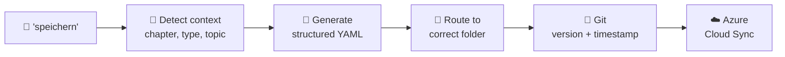
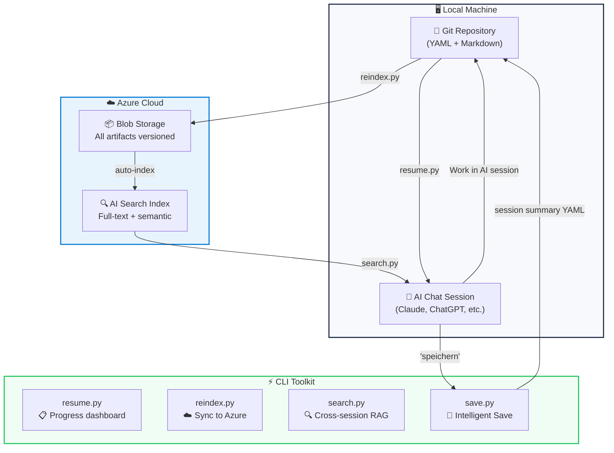
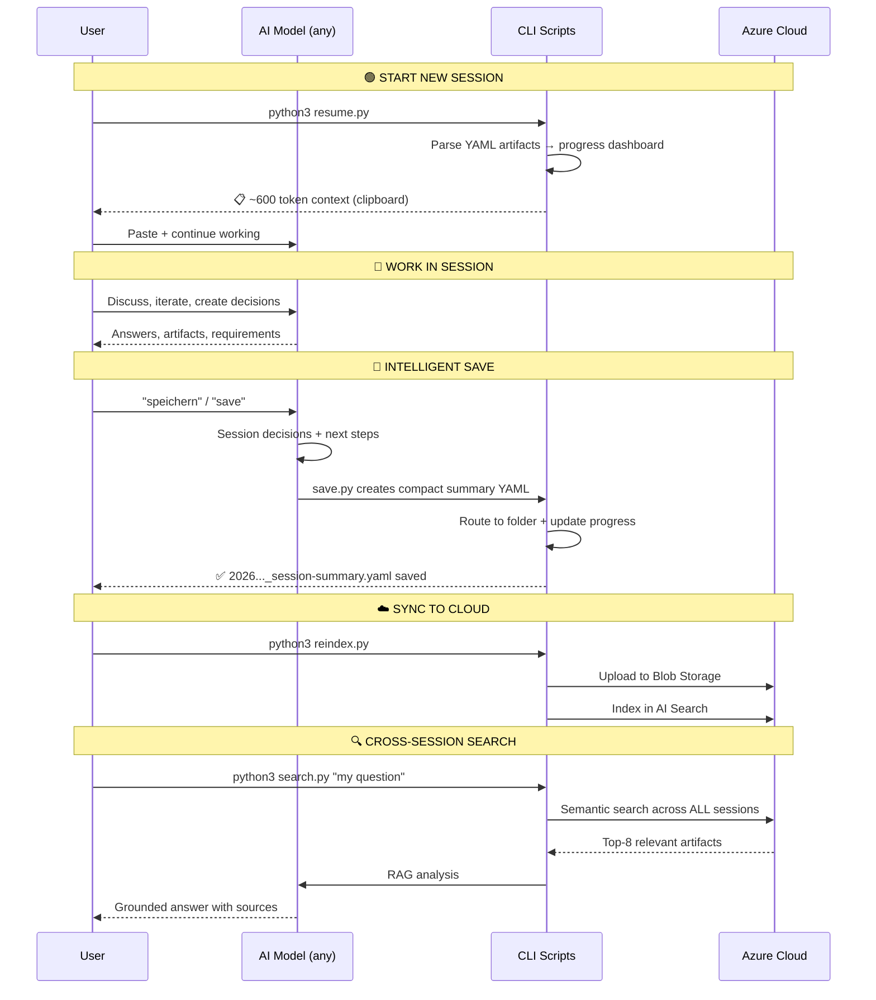

# 🏦 AI Context Vault

**A reusable toolkit for turning AI sessions into structured, searchable project artifacts.**

> This repo packages a workflow I originally built in a thesis setting into a reusable toolkit. The core problem was stable across projects: **unstructured artifacts, isolated knowledge, and no audit trail**. The result is not a generic chat wrapper, but a research-informed engineering pattern for knowledge-intensive AI work.

[](LICENSE)
[](https://python.org)
[](https://azure.microsoft.com)
[](docs/ACADEMIC_VALIDATION.md)

---

## What I Built (Portfolio Snapshot)

- Engineered an AI workflow that turns long chats into compact, structured YAML artifacts.
- Implemented one-command session persistence with auto-routing (`save.py`) and resumable context (`resume.py`).
- Added cloud synchronization and retrieval (`reindex.py`, AI Search, Blob Storage) for cross-session continuity.
- Integrated robust fallback summarization paths (Claude -> Azure OpenAI -> local rules).
- Productionized multi-repo isolation with dedicated Blob containers to prevent cross-project context mixing.

## The Problem

Working on complex AI projects across multiple models and sessions, I discovered **3 concrete problems** that modern AI platforms don't solve:

### PD1: 📋 Unstructured Artifacts

AI models (Claude Projects, ChatGPT Memory, Gemini Workspace) remember conversations well. But they store **files, not manageable artifacts**.

After 20 sessions, I had:
- Hundreds of messages scattered across chats
- Decisions, requirements, quality gates buried in threads
- No way to query "all approved requirements" or "all open gates"
- No structured overview

> **Literature says:** Cloud-based artifact management with structure (not just files) improves collaboration in distributed teams (Schlegel & Sattler, 2022; Gaikwad, 2024).

### PD2: 🏝️ Isolated Knowledge Silos

```
Claude Projects    → only accessible in Claude
ChatGPT Memory     → only accessible in ChatGPT
Gemini Workspace   → only accessible in Gemini
```

My knowledge was **fragmented** – no shared layer across models.

> **Literature says:** Cloud-based knowledge services improve accessibility and coordination in distributed teams (Gupta et al., 2022; Muralikumar & McDonald, 2025).

### PD3: 📜 No Compliance-Ready Documentation

For regulated or research-heavy AI work, I needed:
- Versioned artifacts with timestamps and sources
- Traceable decision chains
- Structured evidence

Chat history is **not an audit trail**.

> **Literature says:** Structured, versioned artifact management and documentation are core best practices for AI governance and regulatory compliance (Winecoff & Bogen, 2024; Lucaj et al., 2025; Cantallops et al., 2021).

---

## My Solution

I combined **3 established best practices** from research into one toolkit:

| Problem | Research-Based Solution |
|---|---|
| 📋 Unstructured Artifacts | Cloud artifact management + structured YAML with metadata |
| 🏝️ Isolated Knowledge | Azure Cloud as neutral, model-agnostic knowledge layer |
| 📜 No Audit Trail | Git-versioned YAML → traceable, diff-able, timestamped |

**Bonus:** Context compression reduces full project state (30,000 tokens) to ~600 tokens — aligns with RAG best practices (Liu et al., 2023; Akesson & Santos, 2024).

---

## ✨ Intelligent Save

The practical result: I can say **"speichern"** (or **"save"**) in my AI chat, and Claude automatically:



This is **not just "save the chat."** It's:
- **Chat → structured artifact** with ID, status, source reference
- **Auto-routing** to the correct project folder
- **Progress tracking** updated automatically
- **Instantly searchable** via Azure AI Search

## 🧭 Multi-Repo Production Setup

This toolkit can be used together with a dedicated content repository:

- `ai-context-vault` -> reusable workflow toolkit (scripts + RAG workflow)
- `genaiops-thesis` -> domain content and chapter artifacts

Blob sync is separated by container to avoid cross-project data mixing:

- `context-vault-summaries` -> artifacts from this toolkit repo
- `thesis-session-summaries` -> artifacts from thesis repo

Azure AI Search can intentionally stay shared across repos for cross-model continuity.
To keep retrieval clean, each summary carries routing metadata:

- `repo_scope` (`vault` or `thesis`)
- `summary_type` (`technisch` or `fachlich`)
- `source_repo` (`ai-context-vault` or `genaiops-thesis`)

Query best practice: filter by `source_repo` first, then widen only when needed.

---

## 🔄 Architecture & Workflow



### Workflow Step-by-Step



---

## 🚀 Quick Start

### 1. Clone & Install

```bash
git clone https://github.com/MustDemir/ai-context-vault.git
cd ai-context-vault
pip install -r requirements.txt
cp .env.example .env
# Edit .env with your Azure credentials
```

### 2. Setup Azure Resources

```bash
python3 scripts/create_index.py
```

<details>
<summary>📋 Azure Setup Guide (click to expand)</summary>

**What you need:**
- Azure account (free tier works!)
- Storage Account (Blob Storage)
- Azure AI Search service (free tier: 50MB, 3 indexes)

**Steps:**
1. Create a Storage Account → note the name + key
2. Create an Azure AI Search service → note the endpoint + key
3. Copy `.env.example` to `.env` and fill in credentials
4. Run `python3 scripts/create_index.py` to create the search index

</details>

### 3. Daily Workflow

```bash
# ✨ INTELLIGENT SAVE (primary)
# 1) Put SHORT session notes into a file (not full raw chat transcript)
python3 scripts/save.py --input session_notes.txt --source chatgpt --topic auto

# ☁️ Optional Blob sync for this single save run
python3 scripts/save.py --input session_notes.txt --source chatgpt --topic auto --blob

# 📋 Resume a session (compact context output)
python3 scripts/resume.py

# ☁️ Sync all artifacts to Azure
python3 scripts/reindex.py --azure

# 🔍 Search across this repo's summaries (default)
python3 scripts/search.py "what are the compliance requirements?"

# 🧩 Legacy/manual extraction (optional fallback)
python3 scripts/extract_yamls.py --input chat.txt --type requirements
```

Behavior change (2026-03-06):
- `save.py` does not auto-sync to Blob by default anymore.
- If you want Blob upload for a single run, add `--blob`.
- If you want legacy auto-sync behavior, set `SAVE_AUTO_BLOB_SYNC=1` in `.env`.

---

## 📊 Token Efficiency

While modern AI models support large context windows, reloading full project contexts per session is inefficient:

| Approach | Tokens per Session | 10 Sessions | Cost (Claude) |
|---|---:|---:|---:|
| ❌ Load full project context | ~30,000 | 300,000 | ~$4.50 |
| ❌ Re-explain everything | ~15,000 | 150,000 | ~$2.25 |
| ✅ **resume.py** (structured) | **~600** | **6,000** | **~$0.09** |

Savings matter at scale — and align with RAG optimization research (Liu et al., 2023; Jin et al., 2024).

---

## 🗂️ Project Structure

```
ai-context-vault/
├── scripts/
│   ├── save.py             # 🧠 Primary end-of-session summary save
│   ├── workflow_lib.py     # ⚙️ Shared save/reindex/resume logic
│   ├── resume.py           # 📋 Compact resume context
│   ├── reindex.py          # ☁️ Sync summaries to Azure (Blob + Search)
│   ├── search.py           # 🔍 Cross-session RAG query
│   ├── extract_yamls.py    # 🧩 Legacy/manual extraction
│   └── create_index.py     # 🏗️ Azure Search index setup
├── docs/
│   ├── ARCHITECTURE.md     # Design decisions
│   ├── ACADEMIC_VALIDATION.md  # Research backing
│   └── session_summaries/  # Current toolkit summaries
├── examples/
│   ├── session_summaries/  # Example summary artifacts
│   └── yaml_templates/     # Example YAML templates
│       ├── requirement_template.yaml
│       ├── gate_template.yaml
│       └── chapter_state_template.yaml
├── .memory/                # Generated local index + resume context
├── .env.example
├── requirements.txt
├── LICENSE
└── README.md
```

---

## 🔧 How Each Script Works

### `save.py` – Primary Intelligent Save 🧠

```
Input:  Short session notes text (--input/--text/stdin), not full raw chat dumps
Output: Compact YAML summary routed to the right folder

Pipeline:
1. Detect topic             → architecture/requirements/evaluation/general
2. Build summary bullets    → decisions + next steps
3. LLM summary (3-tier):    Claude Haiku → Azure OpenAI → local rules
4. Save YAML artifact       → session_summaries/*
5. Optional Blob sync (explicit `--blob`, or `SAVE_AUTO_BLOB_SYNC=1`)

Token cost: ~$0.001 with Claude Haiku, ~$0 with local rules
```

`save.py` sync behavior:
- default: local save only (no Blob sync)
- one-off Blob sync: pass `--blob`
- keep old auto-sync behavior: set `SAVE_AUTO_BLOB_SYNC=1` in `.env`

### `resume.py` – Compact Session Context 📋

```
Input:  Session summary artifacts
Output: Compact context block for next chat

Pipeline:
1. Read latest session summaries
2. Build concise status snapshot
3. Print + store in `.memory/resume_context.txt`

Token cost: $0 (local parsing only)
```

### `reindex.py` – Azure Cloud Sync ☁️

```
Input:  Local session summaries
Output: Updated Blob + AI Search index

Pipeline:
1. Rebuild local `.memory/index.json`
2. Rebuild `.memory/resume_context.txt`
3. Push summaries to AI Search (schema-aware)
4. Blob sync with SHA-256 change detection
5. Skip unchanged blobs to reduce operations

Token cost: $0 (Azure SDK only)
```

### `search.py` – Cross-Session RAG Engine 🔍

```
Input:  Natural language question
Output: Grounded answer from indexed summaries, repo-scoped by default

Pipeline:
1. Azure AI Search (Top-8 within the repo scope by default)
2. Assemble context from retrieved artifacts
3. Send to Claude API with references
4. Return answer with [1], [2] citations

Default behavior: filter by `source_repo` for clean isolation in a shared index
Optional behavior: widen search scope if you intentionally want cross-repo retrieval

Token cost: ~$0.01-0.05 per query
```

### `extract_yamls.py` – Legacy Fallback 🧩

```
Fallback when you need to parse older chat exports manually:
python3 scripts/extract_yamls.py --input chat.txt

Pipeline:
1. Parse long chat export
2. Extract YAML artifacts via Claude
3. Save to project structure

Token cost: ~$0.05-0.20 per extraction
```

---

## 🌐 Cross-Model Compatibility

This toolkit is **model-agnostic by design**. Azure Cloud is the neutral knowledge layer:

| Model | How to Use |
|---|---|
| **Claude** | Paste `resume.py` output → continue |
| **ChatGPT** | Paste `resume.py` output → continue |
| **Gemini** | Paste `resume.py` output → continue |
| **Local LLMs** | Paste `resume.py` output → continue |
| **Any future model** | Paste `resume.py` output → continue |

Unlike Claude Projects (Claude-only) or ChatGPT Memory (ChatGPT-only), your artifacts live in **your** Azure subscription — independent of any vendor.

---

## 📚 Academic Backing

This toolkit combines **3 established best practices from peer-reviewed research**:

1. **Cloud Artifact Management** → Improves collaboration in distributed teams
2. **Structured Documentation** → Core best practice for AI governance and compliance
3. **Context Reuse + RAG** → Established optimization direction

**See [docs/ACADEMIC_VALIDATION.md](docs/ACADEMIC_VALIDATION.md) for complete research backing and citations.**

The specific combination (Azure + RAG + CLI + YAML) is an **engineering pattern** based on established principles — not yet a formalized standard, but aligned with research recommendations for production-ready RAG systems.

---

## 🏗️ Azure Architecture

```
┌──────────────────────────────────────────────────┐
│                  Azure Cloud                      │
│        (neutral, model-agnostic layer)            │
│                                                   │
│  ┌───────────────────┐  ┌──────────────────────┐ │
│  │  Blob Storage      │  │  AI Search           │ │
│  │  ─────────────     │  │  ─────────           │ │
│  │  📄 YAML artifacts │──│  🔍 Full-text search │ │
│  │  📄 MD docs        │  │  🔍 Semantic ranking │ │
│  │  📄 Evidence chain │  │  🔍 Cross-session    │ │
│  └───────────────────┘  └──────────────────────┘ │
│         ↑                        ↓                │
│     reindex.py               search.py            │
└──────────────────────────────────────────────────┘
         ↑                        ↓
┌──────────────────────────────────────────────────┐
│               Local Machine                       │
│                                                   │
│  📁 Git repo ──→ resume.py ──→ 📋 Any AI model   │
│       ↑                            ↓              │
│  "speichern" ←── 💬 AI Chat Session               │
└──────────────────────────────────────────────────┘
```

---

## 💡 Use Cases

- **🧠 Intelligent Save** – `save.py` creates compact summary YAML, routes it, and syncs
- **📚 Thesis Management** – Track requirements, gates, progress across chapters and sessions
- **🏢 Multi-Model Projects** – Shared knowledge base across Claude, ChatGPT, Gemini via Azure
- **⚖️ Compliance Documentation** – Git-versioned evidence chain (EU AI Act, ISO 42001)
- **🔍 Cross-Session Search** – RAG across ALL your work, not just current project
- **🔬 Knowledge-Intensive Projects** – Structured artifact management at scale

---

## 🤝 Contributing

Contributions welcome! Please open an issue or pull request.

## 📄 License

MIT License – see [LICENSE](LICENSE)

## 👤 Author

**Mustafa Demir** – SRH Fernhochschule, M.Sc. Digital Management & Transformation

[](https://github.com/MustDemir)

---

*Built with Azure, Claude API, and Python. I recognized a problem in my AI workflow, researched how established best practices could solve it, and implemented a toolkit. It's research-backed engineering, not reinventing the wheel.*
